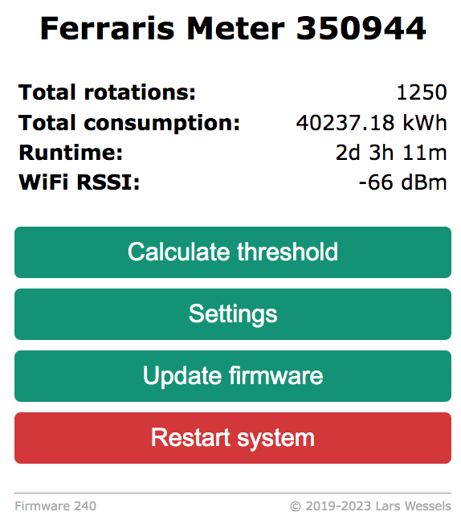
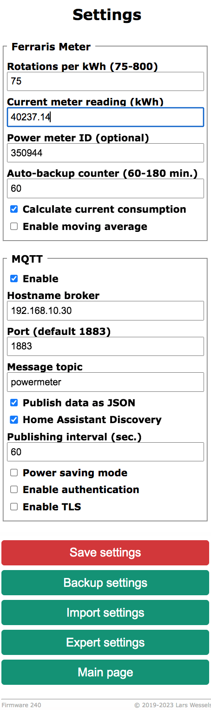

# ESP8266 Wifi Power Meter (Ferraris)

## Description

 

Using the analog output of an IR sensor, the rotation of a Ferraris
electricity meter are detected. The total meter reading (KWh) and current
consumption (Watt) are displayed on an embedded web page and optionally published
via MQTT. As visual feedback the blue LED on the Wemos D1 mini board blinks if
the red marker has been detected. An embedded web server helps to adjust
various parameters to fine-tune the sensor setup and also offers a simple
RESTful interface to retrieve the meter reading. The total consumption
reading and sensor settings are frequently saved to (pseudo) EEPROM to
migate counter resets due to possible intermediate power failures.

## Shopping list

* [Wemos D1 mini](https://arduino-projekte.info/wemos-d1-mini/) development board
* [TCRT5000](https://www.google.com/search?q=TCRT5000) IR sensor board
* 5V (250mA) Power supply with micro USB plug

You don't have to use a Wemos D1 mini board. A NodeMCU or any other ESP8266
based development board will work just fine.

## Using the TCRT5000's analog output (A0) instead of D0

Since the low/high pulses generated by the widely used TCRT5000 sensor on D0 are
not very reliable (e.g. multiple counts for single pass of the "red marker" on
the ferraris disk) its analog output (A0) is used to automatically determine a
suitable threshold value to detect the marker. This way you don't need to fiddle
around with the small potentiometer on the sensor board to find the "right" trigger
threshold for your specific sensor mounting setup.

## Compiling the firmware for the Wemos D1 mini

While version 1.x was written and compiled with the Arduino IDE, version 2.x
was developed with [Visual Studio Code](https://code.visualstudio.com/) and
the [PlatformIO add-on](https://platformio.org/install/ide?install=vscode).
The later is more convenient for larger projects especially when you split
your code across multiple files and are used to syntax highlighting and
seamless Git integration. But of course you can still compile it with the
Arduino IDE (see instructions below).

After you've downloaded Visual Studio Code and installed the PlatformIO add-on,
clone or download this repository to your pc or laptop, open the project folder
in VSC and edit the file `include/config.h`. Starting with version 2.x all settings
found in this file can also be set in the web interface of the Wifi Power Meter.
The only thing you need to set before you compile the firmware is the language
of the web interface which defaults to English. For a German user interface just
comment the line with `LANGUAGE_EN` at the beginning of the file.

To build and upload the firmware via USB to your Wemos D1 mini or NodeMCU just
click on the right arrow in the blue bar on the bottom of VSC. All necessary libraries
(see `platformio.ini`) will be downloaded automatically. Eventually you'll see
the upload starting in a terminal window. If it fails you probably need to adjust
the settings for `port` in `plattformi.ini`. The project was developed on MacOS
which uses UNIX style devices names. On Windows you need to specify a `COM` port.

To compile and install the firmware with the Arduino IDE, you have to
[add support for ESP8266 based boards](https://github.com/esp8266/Arduino) first
using the boards manager. Then make sure, that the following libraries have been
installed with the [Arduino IDE library manager](https://www.arduino.cc/en/Guide/Libraries):

* [EPS8266Wifi](https://github.com/esp8266/Arduino/tree/master/libraries/ESP8266WiFi)
* [ESP8266WebServer](https://github.com/esp8266/Arduino/tree/master/libraries/ESP8266WebServer)
* [ArduinoJson](https://arduinojson.org/)
* [PubSubClient](https://github.com/knolleary/pubsubclient/releases)
* [EEPROM_Rotate](https://github.com/xoseperez/eeprom_rotate)
* [WiFiManager](https://github.com/tzapu/WiFiManager)
* [movingAvg](https://github.com/JChristensen/movingAvg)

Since the Arduino IDE requires all files to be in one folder, you need to move
the header files from `include` to `src`. Then rename `main.cpp` to `powermeter.ino`
and finally the directory `src` to `powermeter` or the Arduino IDE will complain
that the name of the main source file does not match the directory where it is located.
Before you hit compile and upload, make sure that you've selected `Wemos D1 R2 & mini`
or whatever ESP8266 board you are using as the target platform under `Tools`.

## Hardware Schematics

Connect the 5V pin of the TCRT5000 sensor to 3.3V pin (not 5V!) of the Wemos
board and its ground pin to GND. The analog output of the TCRT5000 sensor (A0)
must be connected to the corresponding analog input (A0) of the Wemos. The Wemos
can be powered with a small USB power supply (5V, around 250mA).

## Initial setup of WiFi connection

After the first power-up, the [WifiManager](https://github.com/tzapu/WiFiManager)
will create the access point `WifiPowerMeter-XXXXXX` (with no password) to connect
the Wemos D1 to your local WiFi network. If you have set your WiFi credentials
the ESP8266 will received an IP via DHCP (check serial debug message or your router).
Point your favourite browser to the IP. If you can establish a connection to the
embebbed web server, you can proceed mounting the sensor and the controller board
on your ferraris meter.

## Mounting the sensor on the ferraris meter

For mounting the TCRT5000 on your ferraris meter a little 3D printed case
comes in handy. Thingiverse offers quite a few options like
[this one](https://www.thingiverse.com/thing:2668168).

Since the firmware also supports OTA updates, you only need to flash your ESP8266
once before mounting it in your meter cabinet. Please note that all settings might
be reset to their default values if the structure of the system settings stored in
ESP8266's flash changes with a new firmware. To avoid having to start from scratch
after a firmware update, **all system settings can be exported to a JSON file**,
which you can upload after an update to restore your configuration.

## Setting the threshold to detect the red marker

Make sure that during the initial calibration phase (default 90 secs.), which is
triggered by `Calculate Threshold`, the ferraris disk is actually spinning fast
enough. The calculation of the IR sensor pulse threshold should be based on
at least two full rotations with the red marker passing the IR sensor twice.
Turning on your oven or water kettle should help to speed up things. ;-)

After the initial and hopefully successful calibration cycle, you only have to
save the calculated threshold value with `Save Threshold` to switch the WiFi
Power Meter to normal operation. You can tune the threshold value and other
parameters under `Expert settings`, but you should be OK with the default settings.

In a last configuration step you have to set `Rotations per kWh` under `Settings`
to the value of the Ferraris meter (the default value is 75) and sync the
current kWh reading of the meter with the setting `Current Consumption` of
the Wifi Power Meter.

 
&nbsp;&nbsp;&nbsp;&nbsp;&nbsp;&nbsp;
 

## Receive meter readings via MQTT or RESTful

I'm using MQTT (enabled under `Settings`) to pass the meter readings to [Home
Assistant](https://www.home-assistant.io) using its [discovery
function](https://www.home-assistant.io/docs/mqtt/discovery/). Sensor readings
are published to single topics or as JSON at `<maintopic>/<sensorid>/state`.
The address of the MQTT Broker, publishing interval, optional TLS encryption,
`maintopic` and `sensorid` can be configured under `Settings`.

The Wifi Power Meter also offers support for RESTful HTTP requests. Readings are
available as JSON under `http://<IP>/readings`. See `restful.html` as an example.

## Power Saving Mode (experimental)

If you have enabled `MQTT` and `Power Saving Mode` under `Settings`, the Wifi
Power Meter will turn off WiFi between MQTT messages. This reduces the current
consumption from 95mA to about 35mA (20mA ESP8266 and 15mA TCRT5000) which
might be low enough to run the device from a single 18650 cell for a few days.
The `Power Saving Mode` is experimental and was not tested over long period of
time. When the ESP8266 reconnects to your WiFi network, which takes a few seconds,
the IR sensor may miss the red marker resulting in slight errors in the total
consumption readings.

Please note that the web interface will be inaccessible after 5 minutes and
thereafter if `Power Saving Mode` was enabled. The Wemos D1's blue LED
will flash every 5 seconds. To regain access to the web interface you will need
to power down the Wifi Power Meter or send the retained MQTT message `0` to
`<maintopic>/<sensorid>/cmd/powersave`. The MQTT publish interval which also
determines the time for intermediate WiFi wakeups can be configured (in seconds) 
using the topic `<maintopic>/<sensorid>/cmd/mqttinterval`.

## Debug readings with InfluxDB and Grafana

For debugging purposes you can activate UDP streaming of raw A/D readings from the
IR sensor to an [InfluxDB](https://www.influxdata.com/products/influxdb-overview/)
under `Expert settings`. Contiously visualizing the readings with [Grafana](https://grafana.com/oss/grafana/)
might help placing the TCRT5000 on your electricity meter to get better readings.

Note that InfluxDB version >=2 requires the Telegraf
[Socket Listener](https://github.com/influxdata/telegraf/blob/master/plugins/inputs/socket_listener/README.md)
plugin to process UDP line protocol streams.

## Contributing

Pull requests are welcome! For major changes, please open an issue first to discuss
what you would like to change.

## License

Copyright (c) 2019-2023 Lars Wessels  
This software was published under the MIT license.  
Please check the [license file](LICENSE).
